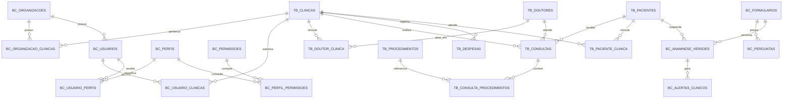

# Mapeamento de dados para continuidade do SaaS

## 1. Objetivo e fontes

Este documento é o mapa de continuidade do Billing Control para as próximas áreas do produto: **Consultas**, **Doutores** e **Financeiro**. Ele deve ser lido antes de criar novas rotas, telas ou migrações.

Fontes usadas:

- esquema real de `dataset_dev_trusted_clinica_validacao`, consultado pelo `INFORMATION_SCHEMA` em 29/09/2026;
- DDLs e migrações versionados em `sql/`;
- consultas e regras do repositório `backend/app/repositories/mvp.py`;
- reconciliações já executadas no dataset de validação.

Regras importantes:

- o dataset de validação é a referência de desenvolvimento; não executar os SQLs diretamente no dataset principal;
- as chaves e relacionamentos descritos são **lógicos**: o BigQuery não aplica chaves estrangeiras ou unicidade;
- a API e as reconciliações devem impedir duplicidade, vínculo cruzado entre clínicas e registros órfãos;
- `id_organizacao` delimita o cliente pagante e `id_clinica` delimita a unidade operacional;
- dados clínicos, pessoais e financeiros sempre devem ser filtrados pela organização e pelas clínicas autorizadas do usuário.

## 2. Visão geral dos domínios



Legenda dos nomes abreviados no diagrama:

- `TB_CLINICAS`: `tb_trat_billing_control_clinicas`;
- `TB_DOUTORES`: `tb_trat_billing_control_doutores`;
- `TB_DOUTOR_CLINICA`: `tb_trat_billing_control_doutor_clinica`;
- `TB_CONSULTAS`: `tb_trat_billing_control_consultas`;
- `TB_CONSULTA_PROCEDIMENTOS`: `tb_trat_billing_control_consulta_procedimentos`;
- `TB_PROCEDIMENTOS`: `tb_trat_billing_control_procedimentos`;
- `TB_DESPESAS`: `tb_trat_billing_control_despesas`;
- `TB_PACIENTES`: `tb_trat_billing_control_pacientes`;
- `TB_PACIENTE_CLINICA`: `tb_trat_billing_control_paciente_clinica`.

## 3. Isolamento da organização e da clínica

O caminho de autorização é:

```text
Firebase UID
  -> bc_usuarios.firebase_uid
  -> bc_usuarios.id_organizacao
  -> bc_organizacao_clinicas.id_clinica
  -> bc_usuario_clinicas.id_clinica
  -> tabelas operacionais filtradas por id_clinica
```

Regras obrigatórias para todas as novas rotas:

1. Resolver o usuário autenticado em `bc_usuarios` e exigir `ativo = TRUE`.
2. Verificar o perfil e a permissão solicitada.
3. Verificar vínculo ativo em `bc_usuario_clinicas` para a clínica da URL.
4. Confirmar que a clínica pertence à mesma organização em `bc_organizacao_clinicas`.
5. Incluir `id_clinica` em toda leitura, escrita, idempotência e auditoria.
6. Nunca confiar em `id_clinica`, `id_doutor` ou `id_paciente` enviados pelo frontend sem validar o vínculo no backend.

`FULL_ACCESS` é o proprietário da organização. `RECEPCAO` opera pacientes e anamneses sem aprovação profissional. `FINANCEIRO` deve receber somente as permissões financeiras que forem adicionadas; não deve obter acesso clínico por consequência.

## 4. Catálogo das tabelas atuais

### 4.1 Organização, usuários e autorização

| Tabela | Grão e chave lógica | Ligações | Uso |
| --- | --- | --- | --- |
| `bc_organizacoes` | uma organização por `id_organizacao` | pai de usuários e clínicas | cliente/assinante do SaaS |
| `bc_organizacao_clinicas` | um vínculo por `(id_organizacao, id_clinica)` | organização ↔ clínica | define quais unidades pertencem ao cliente |
| `bc_usuarios` | um usuário por `id_usuario`; `firebase_uid` e e-mail devem ser únicos | organização, perfis e clínicas | identidade interna e situação de acesso |
| `bc_usuario_clinicas` | um vínculo por `(id_usuario, id_clinica)` | usuário ↔ clínica | escopo de dados autorizado |
| `bc_perfis` | um perfil por `id_perfil`/`codigo` | permissões e usuários | `FULL_ACCESS`, `RECEPCAO`, `FINANCEIRO` |
| `bc_usuario_perfis` | um vínculo por `(id_usuario, id_perfil)` | usuário ↔ perfil | perfil efetivo do usuário |
| `bc_permissoes` | uma permissão por `id_permissao`/`codigo` | perfis | capacidade atômica da API |
| `bc_perfil_permissoes` | um vínculo por `(id_perfil, id_permissao)` | perfil ↔ permissão | matriz RBAC |
| `bc_convites` | um convite por `id_convite` | organização, perfil e clínicas | fluxo legado de convite; a tela atual usa criação direta |
| `bc_auditoria` | um evento por `id_auditoria` | usuário, organização, clínica e entidade | trilha imutável de ações administrativas/clínicas |
| `bc_idempotencias` | uma operação por `(chave, operacao)` | resultado serializado | evita repetição de criações e envios |

Campos relevantes:

- `bc_organizacoes`: `id_organizacao`, `nome`, `ativo`, `created_at`, `updated_at`.
- `bc_organizacao_clinicas`: `id_organizacao_clinica`, `id_organizacao`, `id_clinica`, `ativo`, timestamps.
- `bc_usuarios`: identificação, contato, organização, Firebase, situação, troca obrigatória de senha e auditoria da última alteração administrativa.
- `bc_usuario_clinicas`: usuário, clínica, situação e timestamps.
- `bc_auditoria`: ator, organização, clínica, ação, entidade, identificador da entidade e data UTC.

### 4.2 Clínicas e pacientes

| Tabela | Grão e chave lógica | Ligações | Observação |
| --- | --- | --- | --- |
| `tb_trat_billing_control_clinicas` | uma clínica por `id_clinica` | organização, usuários, pacientes, doutores, consultas e despesas | cadastro operacional da unidade |
| `tb_trat_billing_control_pacientes` | uma pessoa por `id_paciente` | clínicas, consultas, responsáveis e anamneses | paciente global, não duplicar por clínica |
| `tb_trat_billing_control_paciente_clinica` | um vínculo por `(id_paciente, id_clinica)` | paciente ↔ clínica | situação e datas de atendimento na unidade |
| `bc_responsaveis` | um responsável por `id_responsavel` | paciente | confirmação para menor de idade |

Campos de clínica:

- identificação: `id_clinica`, `nome_clinica`, `razao_social`, `cnpj_cpf`;
- contato: `email`, `telefone`, `endereco`, `cep`;
- operação: `data_abertura`, `status`, `responsavel`, `cro_responsavel`;
- rastreio: `origem_registro`, `created_at`, `updated_at`.

Campos de paciente:

- identidade: `id_paciente`, `nome_paciente`, `cpf_paciente`, `dt_nascimento`, `sexo`;
- contato: `telefone`, `email`, `endereco`;
- convênio: `flag_possui_plano_odonto`, `plano_odontologico`;
- compatibilidade histórica: `fk_anamnese_paciente`;
- situação global/rastreio: `flag_paciente_ativo`, `origem_registro`, timestamps.

O vínculo `paciente_clinica` contém `data_primeira_consulta`, `data_ultima_consulta` e `flag_paciente_ativo`. Para telas por clínica, a situação preferencial deve ser a do vínculo; o campo global do paciente permanece por compatibilidade até a regra ser unificada.

### 4.3 Doutores

#### `tb_trat_billing_control_doutores`

Grão pretendido: um profissional por `id_doutor`.

Campos:

| Grupo | Campos |
| --- | --- |
| Identidade | `id_doutor`, `nome_doutor`, `cpf_doutor` |
| Registro profissional | `cro`, `cro_estado`, `especialidade` |
| Contato | `telefone`, `email` |
| Financeiro | `percentual_repasse` (`FLOAT64`, valores atuais entre 0 e 100) |
| Compatibilidade | `id_clinica` |
| Situação/rastreio | `flag_ativo`, `created_at`, `updated_at` |

`id_clinica` nesta tabela representa o vínculo histórico/original. Ele não suporta corretamente um mesmo doutor trabalhando em várias clínicas.

#### `tb_trat_billing_control_doutor_clinica`

Grão pretendido: um período de atuação do doutor em uma clínica.

Campos:

- chave: `id_doutor_clinica`;
- vínculo: `id_doutor`, `id_clinica`;
- descrição histórica: `nome_doutor`;
- vigência: `data_inicio`, `data_fim`;
- situação: `flag_ativo`;
- rastreio: `created_at`, `updated_at`.

Chave lógica atual: `(id_doutor, id_clinica)`. Se for necessário manter histórico de entradas e saídas, a chave lógica futura passa a ser `(id_doutor, id_clinica, data_inicio)` e somente um período pode estar aberto por par.

Estado observado no dataset de validação:

- 5 doutores distintos e sem duplicidade de `id_doutor`;
- apenas 1 vínculo em `doutor_clinica`;
- 4 doutores ainda não possuem a ponte correspondente;
- 97 consultas têm doutor, mas não encontram o mesmo par doutor–clínica na ponte;
- nenhuma consulta aponta para um `id_doutor` inexistente;
- nenhuma consulta diverge do `id_clinica` histórico gravado no cadastro do doutor.

Conclusão: **a ponte ainda não é canônica**. Antes da aba Doutores, fazer um backfill idempotente de `doutor_clinica` a partir de `doutores.id_clinica` e das combinações históricas de `consultas`. Depois disso:

- `doutores` será o cadastro global do profissional dentro da organização;
- `doutor_clinica` será a única fonte para clínicas, vigência e situação do vínculo;
- `doutores.id_clinica` ficará somente como compatibilidade e não deverá receber novas regras;
- cada consulta deverá validar que o doutor possui vínculo ativo com a clínica na data do atendimento.

### 4.4 Consultas e procedimentos

#### `tb_trat_billing_control_consultas`

Grão: uma consulta/atendimento por `id_consulta`.

| Grupo | Campos |
| --- | --- |
| Escopo | `id_consulta`, `id_clinica` |
| Pessoas | `id_paciente`, `id_doutor`, `nome_doutor` |
| Compatibilidade de origem | `nome_paciente_origem`, `cpf_origem`, `cpf_tratado`, `fk_consulta_origem` |
| Tempo | `data_consulta`, `mes_consulta` |
| Operação | `status`, `valor_total` |
| Qualidade de vínculo | `flag_paciente_localizado`, `tipo_match_paciente` |
| Rastreio | `created_at`, `updated_at` |

Relações:

- `consultas.id_clinica -> clinicas.id_clinica`;
- `consultas.id_paciente -> pacientes.id_paciente`;
- `consultas.id_doutor -> doutores.id_doutor`;
- `consultas.id_consulta -> consulta_procedimentos.id_consulta`.

`nome_doutor` e os campos de origem são snapshots/compatibilidade. As relações e filtros devem usar os IDs; o snapshot ajuda a preservar o histórico caso o nome seja alterado.

Situação atual:

- 201 consultas, todas com status `FINALIZADA`;
- nenhuma duplicidade de `id_consulta`;
- nenhuma referência a paciente ou doutor inexistente entre os IDs preenchidos;
- 101 consultas sem `id_paciente`, preservadas apenas pelos campos históricos de origem;
- 49 consultas sem `id_doutor`;
- 16 consultas sem `valor_total`;
- nenhuma consulta sem `data_consulta`.

#### `tb_trat_billing_control_consulta_procedimentos`

Grão: um item de procedimento executado dentro de uma consulta por `id_consulta_procedimento`.

Campos: clínica, consulta, chave de origem, `id_proc`, nomes original/tratado, elemento dental, descrição, `valor_consulta` e timestamps.

Relações:

- item → consulta por `(id_clinica, id_consulta)`;
- item → catálogo por `(id_clinica, id_proc)` quando `id_proc` estiver preenchido.

Não existem itens órfãos de consulta ou de procedimento no snapshot atual.

#### `tb_trat_billing_control_procedimentos`

Grão: um procedimento disponível em uma clínica por `id_proc`.

Campos: `id_proc`, `id_clinica`, `nome`, `descricao`, `valor_base`, `tempo_estimado_min`, `flag_ativo`, `created_at`.

`valor_base` é preço de catálogo. `consulta_procedimentos.valor_consulta` é o valor efetivamente aplicado ao item. Nenhum dos dois deve ser interpretado automaticamente como valor recebido.

### 4.5 Despesas e situação financeira atual

#### `tb_trat_billing_control_despesas`

Grão: uma despesa por `id_despesa` e clínica.

Campos:

- escopo: `id_despesa`, `id_clinica`;
- competência/vencimento: `data_vencimento`, `mes_ano`;
- descrição: `nome_despesa`, `prestador`;
- pagamento: `status`, `valor_despesa`, `data_pagamento`;
- rastreio: `created_at`, `updated_at`.

Estado atual: 60 despesas, sendo 59 `OK` e 1 `NOK`; nenhuma sem clínica, vencimento ou data de pagamento. O significado comercial de `OK` e `NOK` não está formalizado no esquema. Não converter esses códigos silenciosamente em `PAGA`/`CANCELADA` sem confirmar a regra do sistema de origem.

### 4.6 Anamnese e evidências

| Tabela | Grão | Ligações/uso |
| --- | --- | --- |
| `bc_formularios` | uma versão de formulário por `id_formulario` | global (`id_clinica NULL`) ou específica da clínica |
| `bc_perguntas` | uma pergunta por `id_pergunta` | formulário, condicionais e geração de alertas |
| `bc_anamnese_versoes` | uma versão imutável por `id_anamnese_versao` | paciente, clínica, formulário, sessão, aprovação e HMAC |
| `bc_alertas_clinicos` | um alerta por versão/código | visível somente ao profissional autorizado |
| `bc_sessoes_paciente` | uma sessão local/remota por `id_sessao` | token armazenado somente como hash, expiração e verificação |
| `bc_anamnesis_evidence` | um evento de evidência por `id_evidencia` | sessão, paciente, clínica, formulário e integridade |
| `tb_trat_billing_control_anamnese_pacientes` | uma representação Trusted por `id_anamnese` | compatibilidade histórica e estado consolidado |

`bc_anamnese_versoes` e `bc_anamnesis_evidence` são particionadas por `DATE(created_at)` e agrupadas por identificadores clínicos. A versão `bc_*` é imutável; a tabela Trusted mantém compatibilidade e leitura consolidada.

## 5. Junções canônicas

### Organização e clínica

```sql
bc_organizacoes.id_organizacao
  = bc_organizacao_clinicas.id_organizacao

bc_organizacao_clinicas.id_clinica
  = tb_trat_billing_control_clinicas.id_clinica
```

### Usuário e clínica autorizada

```sql
bc_usuarios.id_usuario
  = bc_usuario_clinicas.id_usuario

bc_usuario_clinicas.id_clinica
  = tb_trat_billing_control_clinicas.id_clinica
```

As duas cadeias devem ser verificadas: vínculo do usuário não substitui a pertença da clínica à organização.

### Doutor e clínica

Durante o backfill:

```sql
tb_trat_billing_control_doutores.id_doutor
  = tb_trat_billing_control_doutor_clinica.id_doutor

tb_trat_billing_control_doutor_clinica.id_clinica
  = tb_trat_billing_control_clinicas.id_clinica
```

Após a migração, consultas devem usar o par `(id_doutor, id_clinica)` e validar a vigência pela data da consulta.

### Consulta completa

```text
clinica
  -> consulta
      -> paciente
      -> doutor + vínculo doutor_clinica
      -> itens consulta_procedimentos
          -> procedimento de catálogo
```

Todas as junções operacionais devem incluir `id_clinica` quando ele existir nos dois lados, mesmo que o identificador principal pareça global. Isso impede associação cruzada entre unidades.

## 6. Desenho das próximas telas

### 6.1 Aba Consultas

Fonte principal: `tb_trat_billing_control_consultas`.

Complementos:

- nome/contato do paciente em `pacientes`;
- nome, CRO e especialidade em `doutores`;
- situação/vigência em `doutor_clinica`;
- itens em `consulta_procedimentos`;
- catálogo em `procedimentos`.

Filtros mínimos:

- clínica obrigatória;
- período por `data_consulta`;
- status;
- doutor;
- paciente;
- consultas com vínculo pendente de paciente/doutor.

A API deve paginar no backend e calcular totais em consulta separada. Valores exibidos:

- `valor_total` é o total registrado no cabeçalho da consulta;
- a soma de itens deve aparecer separadamente quando divergir;
- não somar cabeçalho e itens, pois representam visões alternativas do mesmo atendimento.

No snapshot atual, cabeçalhos totalizam `46.555,50`, itens totalizam `60.705,50`, 14 consultas não têm itens e 42 consultas divergem entre cabeçalho e soma dos itens. A aba precisa sinalizar a divergência, não corrigi-la automaticamente.

### 6.2 Aba Doutores

Fonte do cadastro: `tb_trat_billing_control_doutores`.

Fonte futura canônica de atuação: `tb_trat_billing_control_doutor_clinica`.

Funcionalidades mínimas:

- listar doutores acessíveis à organização;
- filtrar por clínica, situação, especialidade e CRO;
- cadastrar/editar dados profissionais sem duplicar o mesmo CPF/CRO;
- vincular/desvincular clínicas com vigência e sem exclusão física;
- mostrar número de consultas e faturamento por clínica/período;
- permitir percentual de repasse padrão, mas preservar o percentual aplicado no momento financeiro.

Regra de identidade recomendada:

- `id_doutor` é a identidade interna estável;
- CPF e `(cro_estado, cro)` são chaves naturais candidatas, sujeitas a normalização e validação;
- um doutor pode pertencer a várias clínicas da mesma organização;
- acesso de um doutor ao sistema, caso seja criado depois, deverá usar `bc_usuarios` e perfil próprio; não misturar conta de login com cadastro profissional.

### 6.3 Aba Financeiro: lucro x despesas

Com o esquema atual é possível exibir uma **prévia operacional**, mas ainda não lucro contábil ou caixa real.

Motivos:

- `consultas.valor_total` registra produção/faturamento, não confirma recebimento;
- não há tabela de recebimentos, parcelas, formas de pagamento, descontos, estornos ou inadimplência;
- `consulta_procedimentos.valor_consulta` diverge do cabeçalho em parte dos registros;
- despesas usam códigos legados `OK`/`NOK` sem contrato formal;
- existe percentual de repasse no cadastro do doutor, mas não há lançamento nem pagamento de repasse por consulta.

Até a extensão financeira, nomear o indicador como:

```text
Resultado operacional estimado
  = produção de consultas finalizadas
  - despesas consideradas no período
```

Não usar a palavra `lucro` sem a ressalva de estimativa.

Após criar os movimentos financeiros, os indicadores canônicos devem ser:

```text
Receita produzida = soma dos valores consolidados das consultas finalizadas

Receita recebida = soma de recebimentos liquidados - estornos

Despesa paga = soma dos pagamentos de despesas liquidados

Repasse devido = soma dos repasses calculados e ainda não cancelados

Repasse pago = soma dos repasses com pagamento liquidado

Resultado de caixa = receita recebida - despesa paga - repasse pago - taxas/estornos

Margem de caixa = resultado de caixa / receita recebida
```

Períodos:

- produção: `data_consulta`;
- competência de despesa: `data_vencimento` ou competência explícita;
- caixa: data efetiva do recebimento/pagamento;
- nunca misturar produção e caixa no mesmo cartão sem rótulo claro.

## 7. Extensões de dados recomendadas

Não duplicar imediatamente as tabelas históricas de consultas, doutores e despesas. Primeiro estabilizar as chaves e evoluí-las de forma aditiva no dataset de validação.

### 7.1 Backfill obrigatório de doutor–clínica

Criar um SQL idempotente que:

1. insira pares distintos de `doutores.(id_doutor, id_clinica)` ausentes;
2. insira pares distintos observados em `consultas` e ainda ausentes;
3. defina vigência e `flag_ativo` sem apagar histórico;
4. execute reconciliação de órfãos, duplicidades e consultas fora da vigência;
5. somente depois altere a API para depender da ponte.

### 7.2 Recebimentos de consultas

Criar `bc_recebimentos_consulta` com, no mínimo:

- `id_recebimento`, `id_organizacao`, `id_clinica`, `id_consulta`;
- `numero_parcela`, `forma_pagamento`, `status`;
- `valor_bruto`, `desconto`, `taxa`, `valor_liquido`;
- `data_vencimento`, `recebido_em`, `estornado_em`;
- `idempotency_key`, `created_at`, `updated_at`, ator responsável.

Uma consulta poderá possuir zero ou vários recebimentos. O somatório líquido recebido é a fonte de caixa, não `consultas.valor_total`.

### 7.3 Repasses profissionais

Criar `bc_repasses_profissionais` com:

- `id_repasse`, organização, clínica, consulta e doutor;
- percentual aplicado como snapshot;
- base de cálculo e valor do repasse;
- status (`PENDENTE`, `APROVADO`, `PAGO`, `CANCELADO`);
- competência, `pago_em`, timestamps e auditoria.

O percentual do cadastro é apenas o padrão. O lançamento deve preservar o percentual e a base aplicados à consulta para que mudanças futuras não reescrevam o passado.

### 7.4 Padronização de despesas

Evoluir `tb_trat_billing_control_despesas` de forma aditiva ou criar uma camada operacional com:

- categoria e centro de custo;
- competência explícita;
- status padronizado (`PENDENTE`, `PAGA`, `CANCELADA`, `ATRASADA`);
- forma e identificador do pagamento;
- recorrência e documento de origem;
- ator, origem e idempotência.

Antes da migração, mapear formalmente `OK` e `NOK` e preservar o código original.

## 8. Permissões futuras

Adicionar permissões atômicas, sem depender apenas do nome do perfil:

| Área | Permissões sugeridas |
| --- | --- |
| Consultas | `CONSULTATION_READ`, `CONSULTATION_CREATE`, `CONSULTATION_UPDATE`, `CONSULTATION_CANCEL` |
| Doutores | `DOCTOR_READ`, `DOCTOR_MANAGE`, `DOCTOR_CLINIC_MANAGE` |
| Financeiro | `FINANCE_READ`, `EXPENSE_MANAGE`, `RECEIVABLE_MANAGE`, `PAYOUT_MANAGE` |

Defaults recomendados:

- `FULL_ACCESS`: todas;
- `RECEPCAO`: leitura/criação/edição operacional de consultas e leitura básica de doutores; sem valores financeiros agregados ou repasses;
- `FINANCEIRO`: leitura de cadastros mínimos necessários e gestão financeira; sem anamnese ou alertas clínicos;
- um futuro perfil profissional poderá ler sua agenda/produção, mas não deve herdar administração da organização.

## 9. Qualidade observada no snapshot de validação

Contagens em 29/09/2026:

| Domínio | Tabelas principais e linhas |
| --- | --- |
| Organização | 1 organização, 3 clínicas, 4 usuários |
| Pacientes | 225 pacientes, 226 vínculos paciente–clínica |
| Anamnese | 221 registros Trusted, 5 versões novas, 14 alertas |
| Doutores | 5 doutores, 1 vínculo doutor–clínica |
| Consultas | 201 consultas, 224 itens, 49 procedimentos de catálogo |
| Financeiro | 60 despesas |

Checks aprovados:

- nenhuma duplicidade de `(id_paciente, id_clinica)`;
- nenhuma duplicidade de `id_consulta`;
- nenhum item de procedimento órfão;
- nenhum `id_doutor` preenchido em consulta aponta para doutor inexistente;
- nenhuma despesa sem clínica.

Pendências que bloqueiam métricas definitivas:

- backfill incompleto de `doutor_clinica`;
- 101 consultas sem `id_paciente` e 49 sem `id_doutor`;
- 16 consultas sem total;
- divergência entre total da consulta e soma dos itens em 42 consultas;
- 14 consultas sem itens;
- ausência de recebimentos, repasses e contrato de status de despesas.

## 10. Ordem segura de implementação

1. Criar reconciliação e backfill de `doutor_clinica` no dataset de validação.
2. Implementar APIs e tela de Doutores usando a ponte já reconciliada.
3. Implementar Consultas em modo leitura, exibindo qualidade de vínculo e divergência de valores.
4. Definir com a clínica o ciclo de vida de consulta e os status permitidos.
5. Adicionar escrita de consultas com auditoria, idempotência e vínculo obrigatório por clínica.
6. Definir semanticamente despesas `OK`/`NOK` e categorias.
7. Criar recebimentos e repasses como movimentos imutáveis/auditáveis.
8. Implementar Financeiro separando produção, competência e caixa.
9. Repetir baseline e reconciliação antes e depois de cada migração.
10. Somente após validação promover SQLs aditivos específicos para o dataset principal.

## 11. Checklist para a outra máquina

Antes de desenvolver:

- ler este documento, `docs/manual-primeiros-passos.md` e os DDLs em `sql/ddl/`;
- confirmar que `BIGQUERY_DATASET_TRUSTED` aponta para validação;
- consultar `INFORMATION_SCHEMA` novamente para detectar mudança de esquema;
- não executar DDLs com nomes fixos no dataset principal;
- não criar telas financeiras chamando produção de lucro;
- preservar os 219+ registros históricos e as reconciliações financeiras existentes;
- criar testes de isolamento por organização/clínica e de permissão para cada nova rota;
- versionar cada migração de forma aditiva e idempotente.

Este mapa descreve o estado atual e a direção recomendada. Decisões clínicas, contábeis e de repasse devem ser confirmadas com a proprietária e, quando aplicável, com profissional contábil antes da promoção para produção.
